<div align="center">

# BlockStrike

**An original low-poly, fast-paced browser FPS**

Ten maps · Seven bots · Six weapons · Zero external assets

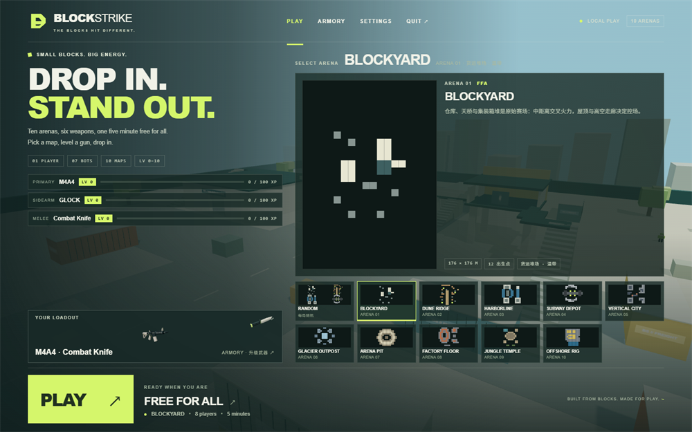


[Play online](https://blockstrike-eight.vercel.app/) | [Quick start](#quick-start) | [Controls](#controls) | [Maps](#maps) | [Weapon progression](#weapon-progression) | [Project layout](#project-layout) | [中文](README.md)

</div>

---

## Overview

BlockStrike is a fast-paced first-person shooter that runs in the browser, built with Vite + TypeScript + Three.js. Terrain, characters, weapons, particles and audio are all generated in code. The ten PNGs in the repository root are only armory preview images for weapon finishes - every 3D asset in the game comes from procedural geometry, canvas textures and Web Audio synthesis. No external 3D models or audio files are used.

The mode is **Free For All**: you and seven bots fight it out over five minutes.

<p align="center">
  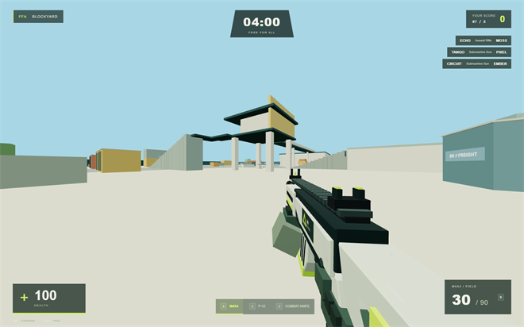
  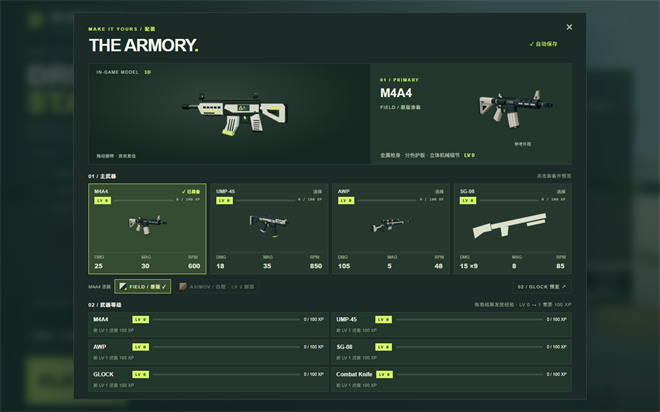
</p>

## Quick start

Requires **Node.js 20.19+ or 22.12+** (22 / 24 recommended).

```sh
npm install
npm run dev
```

Open the local address printed in the terminal and click **PLAY**. The game targets desktop keyboard and mouse; Chrome / Edge are recommended.

> Pointer lock and audio only activate after you click the page. Press <kbd>Esc</kbd> to release the mouse and pause.

Production build and local preview:

```sh
npm run build
npm run preview
```

## Controls

| Action | Key |
| --- | --- |
| Move / aim | <kbd>W</kbd><kbd>A</kbd><kbd>S</kbd><kbd>D</kbd> / mouse |
| Jump / bunny hop | <kbd>Space</kbd> (holdable) |
| Sprint / crouch | <kbd>Shift</kbd> / <kbd>Ctrl</kbd> |
| Fire / aim or scope | Left mouse / right mouse |
| Melee light / heavy | Left mouse / right mouse |
| Reload | <kbd>R</kbd> |
| Primary / pistol / knife | <kbd>1</kbd> / <kbd>2</kbd> / <kbd>3</kbd> |
| Cycle weapons | Mouse wheel |
| Scoreboard | Hold <kbd>Tab</kbd> |
| Pause | <kbd>Esc</kbd> |

## Maps

Pick a map on the right side of the lobby, or choose **RANDOM** to draw one of the ten each match. Your choice is saved locally. Terrain, palette, sky, fog, spawn points and vertical routes are generated independently per map - these are not the same layout with a few blocks moved around:

| # | Map | Theme | Vertical structure |
| --- | --- | --- | --- |
| 01 | BLOCKYARD | Freight yard | Warehouse roofs, catwalks, stacked containers, underpasses |
| 02 | DUNE RIDGE | Desert canyon | Dunes, dry riverbed, cliff ledges, drilling rig, watchtower |
| 03 | HARBORLINE | Container port | Docks on both sides, shallow basin, gantry crane spanning across, cargo ship deck |
| 04 | SUBWAY DEPOT | Underground station | Sunken platform, train roof, inspection pit, two catwalks |
| 05 | VERTICAL CITY | Rooftop city | Streets, 5 m terraces, 13 m elevated walkway ring |
| 06 | GLACIER OUTPOST | Ice outpost | Crevasses, three ice bridges, bunker roof, radar platform |
| 07 | ARENA PIT | Sunken arena | Pit floor, two tiers of stands, four corner towers |
| 08 | FACTORY FLOOR | Heavy workshop | Factory halls, machine rows, two-level maintenance catwalk, tank farm |
| 09 | JUNGLE TEMPLE | Jungle temple | Four-tier pyramid, canopy platforms, rope walkways, pools |
| 10 | OFFSHORE RIG | Offshore platform | Main deck, derrick, helipad, escape ladder back up to the deck |

<details>
<summary><b>Click to see in-game screenshots of all ten maps</b></summary>

<br>

| | |
| --- | --- |
| 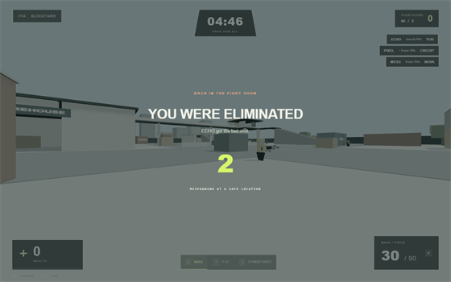<br>**01 BLOCKYARD** Freight yard | 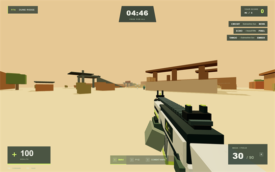<br>**02 DUNE RIDGE** Desert canyon |
| 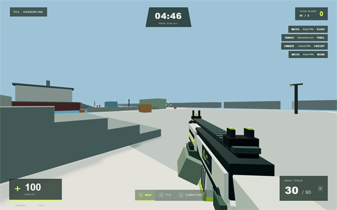<br>**03 HARBORLINE** Container port | 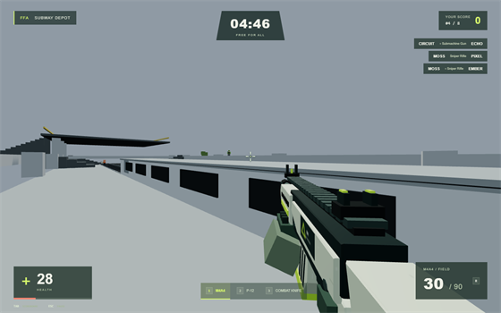<br>**04 SUBWAY DEPOT** Underground station |
| 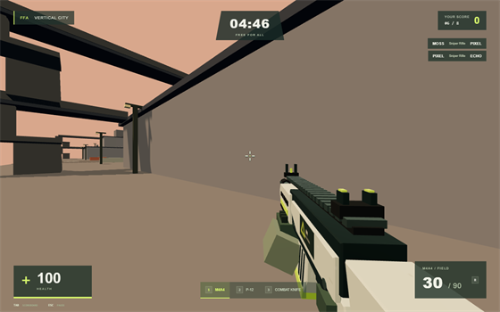<br>**05 VERTICAL CITY** Rooftop city | 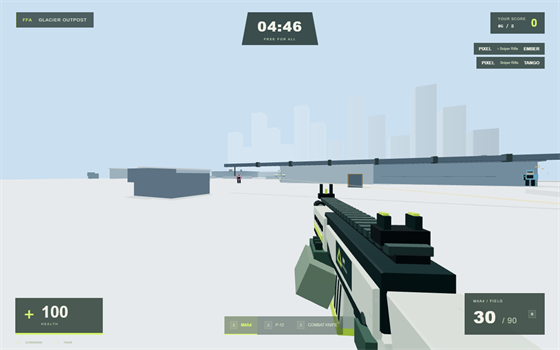<br>**06 GLACIER OUTPOST** Ice outpost |
| 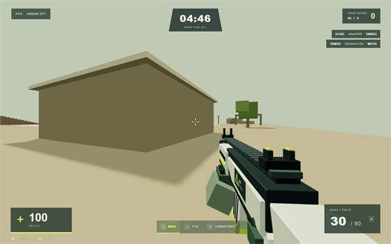<br>**07 ARENA PIT** Sunken arena | 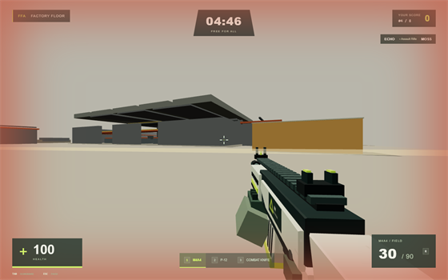<br>**08 FACTORY FLOOR** Heavy workshop |
| 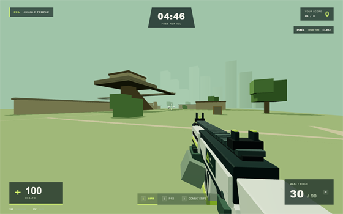<br>**09 JUNGLE TEMPLE** Jungle temple | 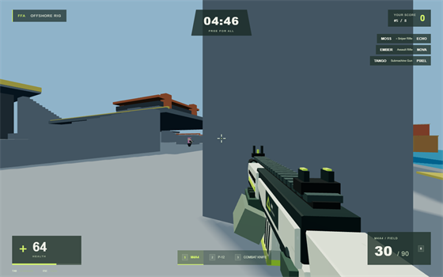<br>**10 OFFSHORE RIG** Offshore platform |

</details>

Every map comes with an automated validation suite (see `tests/maps.mjs`): spawn points are not stuck in walls and are far enough apart, landing never drops you out of the world, the navigation graph is connected, **every vertical route is walked from start to finish using the real collision code**, and seven bots actually run the map.

## Weapon progression

Weapon levels are shown in the main menu and the armory. Each weapon goes up to **LV 10**, starting from 0:

| Level | 0 to 1 | 1 to 2 | 2 to 3 | ... | 9 to 10 |
| --- | --- | --- | --- | --- | --- |
| XP needed | 100 | 160 | 220 | +60 per level | 640 |

XP is only awarded when a match ends: the primary weapon you entered the match with earns `40 + 6 per kill` (plus 20 more for finishing first), so a ten-kill match is exactly 100 XP - one level. The pistol and knife award XP based on their own kills.

Levels unlock finishes: M4A4 ASIMOV requires rifle LV 2, and Butterfly Fade / M9 Ruby / Butterfly Emerald / Karambit Emerald require knife LV 1 / 3 / 5 / 7. Locked appearances show as locked in the armory. Levels and map selection are stored locally.

## Melee

The knife is a pure melee weapon - no throwing, no dropping, no ranged form. Once drawn, it has exactly two actions.

| Action | Input | Damage | Backstab | Hit frame |
| --- | --- | --- | --- | --- |
| Light | Left mouse (hold to keep swinging) | 45 | 90 | 0.16 s into the swing |
| Heavy | Right mouse | 90 | 180 | 0.34 s into the swing |

Drawing the knife plays a full deploy animation (about 0.75 s) with the blade flipping up from the bottom of the screen: the classic knife and the M9 are single-edge draws, while the butterfly knife and karambit spin. You cannot attack while drawing, so switching to the knife has a real cost. The heavy attack has a longer blade - it reaches where the light attack does not.

Damage resolves on the swing's hit frame, so whiffing, getting punished mid-swing, or being spaced out are all possible. Hitting a target from behind counts as a backstab, which switches the hit marker, damage numbers and sound to a backstab variant. The knife uses no ammo, and a melee hit still clears your own spawn protection.

## Match rules

Free For All: 1 player + 7 bots, 5 minutes, +1 point per kill, respawn at a safe point after 3 seconds. Bots are hostile to each other and will also attack you. Pausing freezes the entire match.

## Project layout

| Directory | Responsibility |
| --- | --- |
| `src/core` | Game loop, input, settings and system coordination |
| `src/player` | Fast movement, bunny-hop speed cap, crouching, first-person camera |
| `src/weapons` | Six weapon configs, ammo and reloading, weapon slots, procedural models |
| `src/bots` | Seven AI states, A* pathfinding, ground and elevated navigation graphs |
| `src/world` | `MapKit` terrain helpers, ten map definitions, AABB collision, safe spawns |
| `src/game` | Hit regions, FFA rules, timing and ranking (`GameMode` is extensible) |
| `src/core/Progress.ts` | Weapon levels, XP curve and finish unlocks |
| `src/ui` | Main menu, loadout, settings, HUD, pause, scoreboard and results |
| `src/effects` / `src/audio` | Capped instanced particle pool and Web Audio synthesis |

## Development and verification

`npm test` runs browser acceptance tests against a running local dev server (`world` + `smoke` + `melee` + `maps` + `progress`). It uses the Chrome installed on Windows by default; set `CHROME_PATH` to point at another browser. Tests run on software WebGL, so performance numbers do not reflect real GPU frame rates. Results and screenshots are written to `test-results/`, where `map-*.png` are real in-game screenshots of the ten maps.

<details>
<summary><b>What the acceptance scripts actually check</b></summary>

<br>

Dev mode exposes the game instance on `window.__game` for integration verification; the production build does not.

The acceptance scripts really click the menu and dispatch keyboard and mouse events, then check weapon damage, reloading, hit multipliers, pausing, respawn and results. Weapon tests use controlled targets; bot matches and the full 300-second match are advanced with accelerated simulation but still run the real AI, collision, shooting and scoring code. The scripts also check both staircases and the bot path from the stairs across the roof and bridge to the tower.

A match only starts its clock once the control scheme is ready. `npm run test:capture` covers capture rejection, legacy error events, a missing API, no response and delayed responses, plus cancelling a request, compatibility play and recovery. Normal pointer lock is still verified by `npm test`.

</details>

<details>
<summary><b>Compatibility mouse mode when pointer lock fails</b></summary>

<br>

When pointer lock fails (some embedded browsers do not support it, or Chromium rate-limits repeated requests), the game automatically enables a compatibility mouse mode: move the mouse to aim, steer continuously by moving toward the screen edge or with the arrow keys, fire with left mouse, scope with right mouse, and move with WASD. Pausing happens when the mouse leaves the window or on ESC; RESUME continues in compatibility mode without repeating the failed request.

For an FPS mouse experience unrestricted by window bounds, copy the game URL into a standalone Chrome / Edge window.

</details>

## Known limitations

The current version is offline single-player bot matches; there is no networked multiplayer. A minimap, other game modes and mobile touch controls are not implemented yet. Graphics Low disables shadows and caps the pixel ratio. Actual frame rate depends on your device and browser, and 60 FPS on low-end hardware is not guaranteed.

## Deployment

This is a fully static site. The build output lives in `dist/` and can be hosted on any static host.

**Vercel**: import this repository at [vercel.com/new](https://vercel.com/new). No configuration is needed - Vercel detects Vite automatically, with `npm run build` as the build command and `dist` as the output directory. Every push to `main` redeploys automatically afterwards.

**Other platforms**: run `npm run build` and upload the whole `dist/` directory. No Node runtime is required.

> Note: according to Vercel's own documentation, Vercel has no servers or CDN nodes in mainland China, and `*.vercel.app` domains may be blocked or throttled there. If you are targeting users in mainland China, bind a custom domain or host in-country / in Hong Kong instead.
